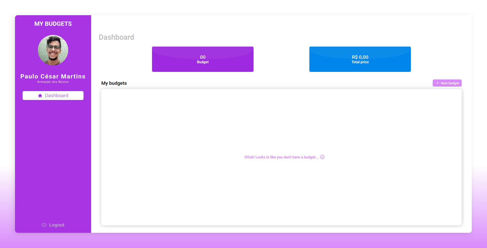
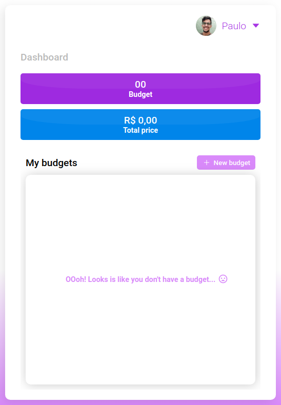

## My budgets

A ReactJS application for technology project costs. To use the service, the customer must have an account registered in the system. Within the system, it will provide the necessary data to request a quote. At the end, the system will display the total value of the project. The client can also consult old budgets.

<br>
<br>



<br>
<br>

<div align="center">

</div>

<br>
<br>

### How to install

💭 Needs to have the backend instaled and running ( <a href="https://github.com/martins20/MyBydgets-Backend">backend</a> )

**Clone the repository**

```
$ git clone https://github.com/martins20/Mybudgets-Frontend.git

$ cd Mybudgets-Frontend

$ yarn install

$ yarn start
```

### Techs

- [x] Typescript
- [x] Axios,
- [x] React,
- [x] Hooks,
- [x] React-router-dom,
- [x] Styled-components,
- [x] Typescript,
- [x] React-loading,
- [x] React-icons,
- [x] Unform,
- [x] Yup
